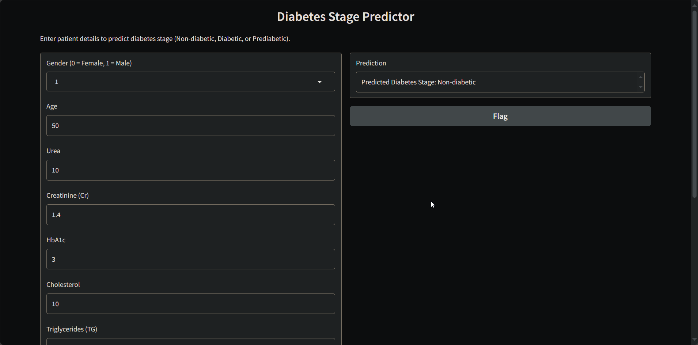

# DiabetesStage 🩺📊

A lightweight Gradio app to predict diabetes stage (Non‑diabetic, Prediabetic, Diabetic) from patient metrics using a pre‑trained Random Forest model.

---

## Table of Contents
- **[Demo](#demo)**
- **[Features](#features)**
- **[Installation / Setup](#installation--setup)**
- **[Usage](#usage)**
- **[Configuration / Options](#configuration--options)**
- **[Contributing](#contributing)**
- **[License](#license)**
- **[Acknowledgements / Credits](#acknowledgements--credits)**

---

## Demo

- Screenshot:



- Video:

<video src="./demo/demo.mp4" controls width="720">Your browser does not support the video tag.</video>

---

## Features
- **Interactive UI** built with `gradio` for fast experimentation.
- **Pretrained artifacts** loaded from `models/` using `joblib`.
- **Consistent preprocessing** with stored scaler for `AGE`.
- **Human‑readable outputs** mapping numeric predictions to labels.

---

## Installation / Setup

```bash
# Create a virtual environment
python -m venv .venv

# Activate it
# On Linux/Mac:
source .venv/bin/activate
# On Windows:
.venv\Scripts\activate

# Install dependencies
pip install -r requirements.txt
```

Ensure model artifacts exist:
- `models/random_forest_diabetes_model.pkl`
- `models/age_scaler.pkl`

---

## Usage

Run the Gradio app:

```bash
python app.py
```

This will launch a local server and open the UI. Provide the following inputs:
- `Gender` (0 = Female, 1 = Male)
- `Age`, `Urea`, `Creatinine (Cr)`, `HbA1c`, `Cholesterol`, `Triglycerides (TG)`, `HDL`, `LDL`, `VLDL`, `BMI`

Prediction is displayed as a label: `Non-diabetic`, `Prediabetic`, or `Diabetic`.

---

## Configuration / Options
- The app is defined in `app.py`, UI in `ui.py`, utilities in `utils.py`.
- To expose the app publicly when running on a remote environment:

```python
# in app.py (example)
iface.launch(share=True)
```

- Default `gradio.Interface.launch()` parameters can be adjusted per your environment (e.g., `server_name`, `server_port`).

---

## Contributing
Contributions are welcome! Please:
- Fork the repository
- Create a feature branch
- Write clear commit messages and include tests or demo steps when applicable
- Open a pull request describing the change and reasoning

---

## License
This project is licensed under the MIT License. See the [LICENSE](./LICENSE) file for details.

---

## Acknowledgements / Credits
- Model development and training done in `predicting-diabetes-stages-with-rf-f1-98.ipynb` using `scikit-learn` and related tools.
- UI powered by `gradio`.
- Data handling via `pandas`.
